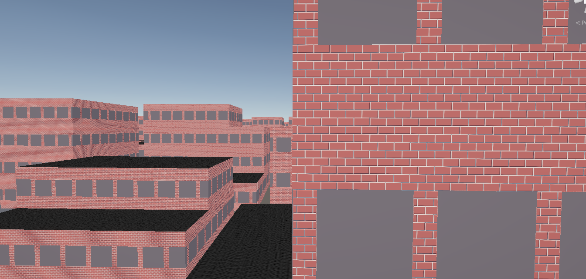
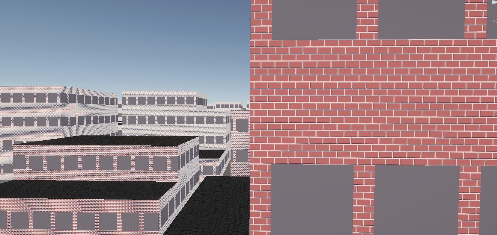
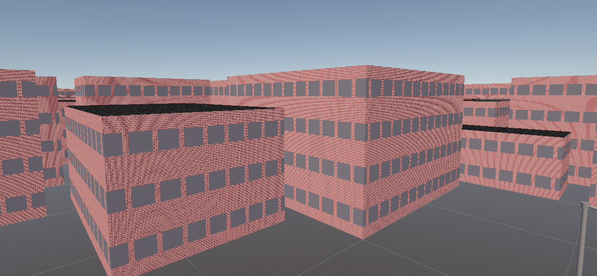
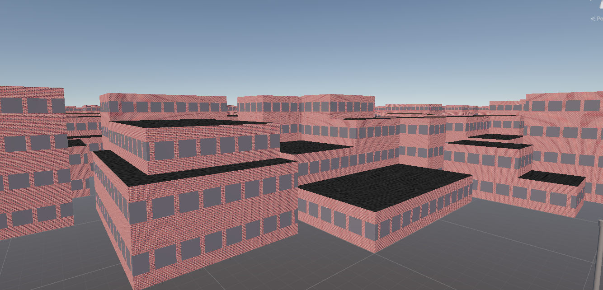
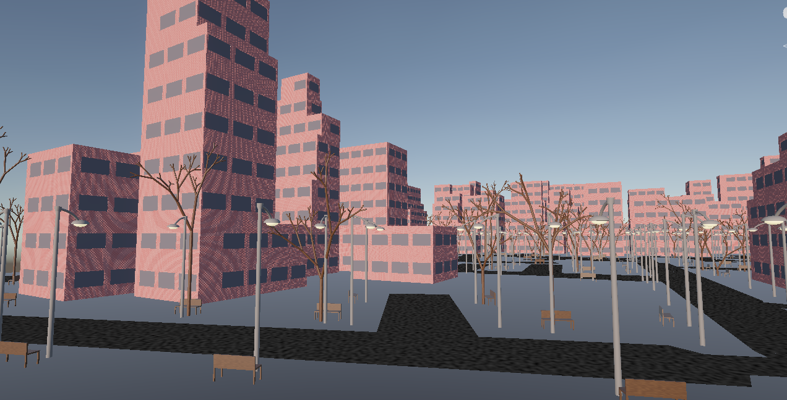

## Description du projet

Ce projet est un projet de groupe que j'ai réalisé en M1. Il consistait à génerer un monde urbain à l'aide de méthodes procédurales en C# sur Unity.
Lors de ce projet je me suis occupé de la création des bâtiments et des textures.
Les bâtiments sont générés à l'aide de Shape Grammar.
Au premier abord la création de texture via des méthodes procédurales peut paraitre difficile, mais beaucoup de texture peuvent être créer en combinant des méthodes procédurales/bruits.
Pour la texture de route et des toitures gravillonnés j'ai utilisé un bruit de Perlin quio permet de créer une sorte de variété de couleur de gravier.
Pour les textures de bâtiments j'ai implémenté une méthode de "Tilling", qui consiste à répéter un motif .
Ces méthodes procédurales rendent un résultat acceptable mais engendre des effets indésirable qui peuvent être résolus par des filtrages.

# Compétences/Méthodes apprises :

- Utilisation Unity
- C#
- Shape Grammar
- Tilling
- Création de Texture Perlin Noise
- Filtre de texture procédurale

## Image du projet
Faites glisser le curseur pour voir la différence avec et sans le filtre.


```{=html}
<div style="position: relative; width: 100%; max-width: 800px; overflow: hidden; border-radius: 12px; margin: 0 auto;">
  
  
  
  
  
  <div id="slider-line" style="position: absolute; top: 0; bottom: 0; left: 50%; width: 4px; background: white; z-index: 3; pointer-events: none; box-shadow: 0 0 10px rgba(0,0,0,0.8);"></div>
  
  <input type="range" min="0" max="100" value="50" id="compare-slider" style="position: absolute; top: 0; left: 0; width: 100%; height: 100%; z-index: 4; opacity: 0; cursor: ew-resize; margin: 0;">
  
</div>

<script>
  // On attend que la page soit chargée
  document.addEventListener("DOMContentLoaded", function() {
    const slider = document.getElementById('compare-slider');
    const imgFg = document.getElementById('img-fg');
    const sliderLine = document.getElementById('slider-line');

    if(slider && imgFg && sliderLine) {
      slider.addEventListener('input', function(e) {
        let val = e.target.value;
        // On modifie le recadrage en concaténant simplement les valeurs (sans caractères spéciaux)
        let poly = 'polygon(0 0, ' + val + '% 0, ' + val + '% 100%, 0 100%)';
        imgFg.style.clipPath = poly;
        imgFg.style.webkitClipPath = poly;
        sliderLine.style.left = val + '%';
      });
    }
  });
</script>

::: {layout-ncol=3}
{fig-align="center"}

{fig-align="center"}

{fig-align="center"}


:::

