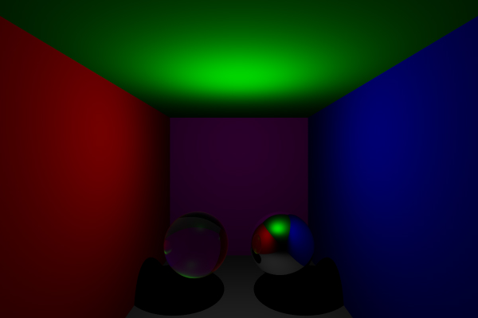
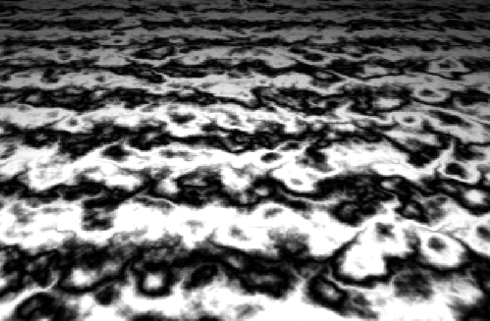
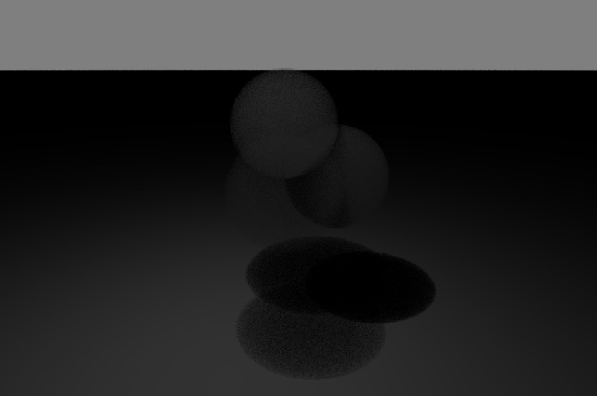
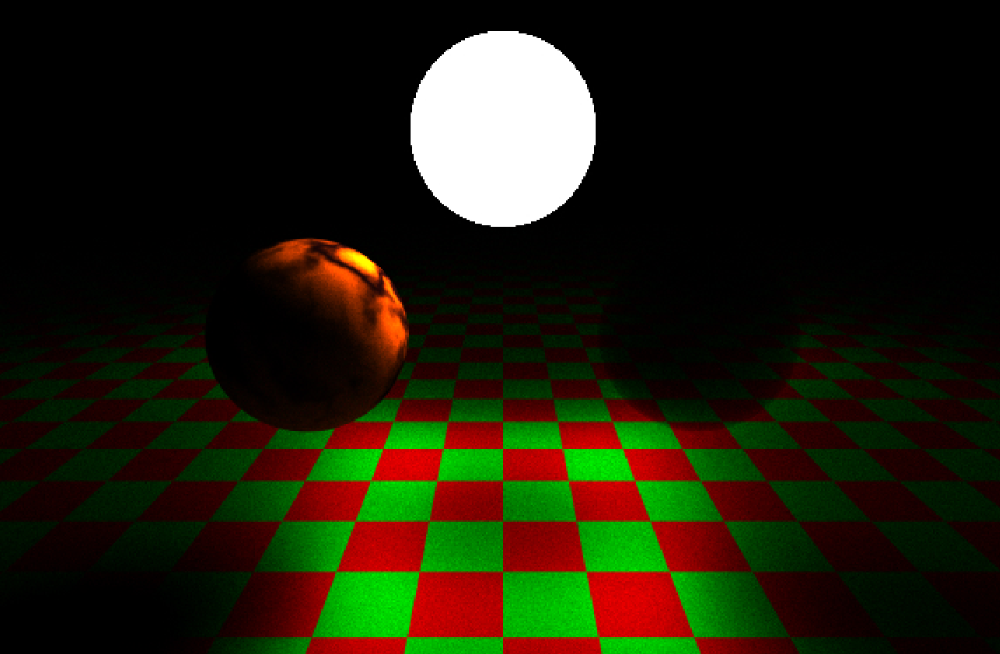

## Description du projet

Projet de Ray Tracer créer lors de ma première année de master en C++. 

Afin de pouvoir utilisé des mesh dans un temps de rendu acceptable on a utilisé le BVH qui est une structure accélératrice.

Lors de ce projet on a pus implémenter la réfration et la réflexion de rayon en respectant la loi de Snell-Descartes.

Ensuite dans ce projet j'ai eu envie d'implémenter des objets émetant de la lumière, pour ce faire j'ai donc créer un path tracer assez basique pour me permettre d'y arriver. J'ai également implémenté des objets volumétriques dans le but de pouvoir représenter de la fumée ou un brouillard. 

J'ai ensuite ajouté des textures procédurales, l'une est une texture de damier/échequiers et l'autres est une texture de perlin noise qui m'as permis de créer une texture de marbre.

# Compétences/Méthodes apprises :

- BRDF
- Structures accélératrice (BVH)
- Création d'objet volumétrique
- Path Tracing
- Création d'objet émmetant de la lumière

## Image du projet

::: {layout-ncol=3}
{fig-align="center"}

{fig-align="center"}

{fig-align="center"}

{fig-align="center"}

:::