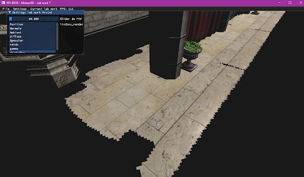
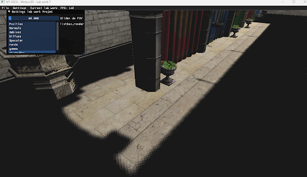
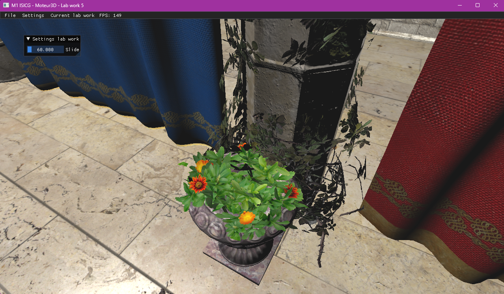

## Description du projet

Lors du permier semestre de la première année du master j'ai eu à créer un moteur de visualisation 3D en C++ avec OpenGL.

Pour l'interface utilisateur on a utilisé ImGUI.

Les Travaux pratique m'ont permis d'appendre énormément de choses.

J'ai également appris à manipuler des shaders "classique" en Forward Rendering ou même en Defferd Shading.

# Compétences/Méthodes apprises :

- Utilisation OpenGL
- Filtres de Textures
- Normal Mapping
- Deffered Shading
- Shadow Mapping

## Image du projet

::: {layout-ncol=3}

:::
